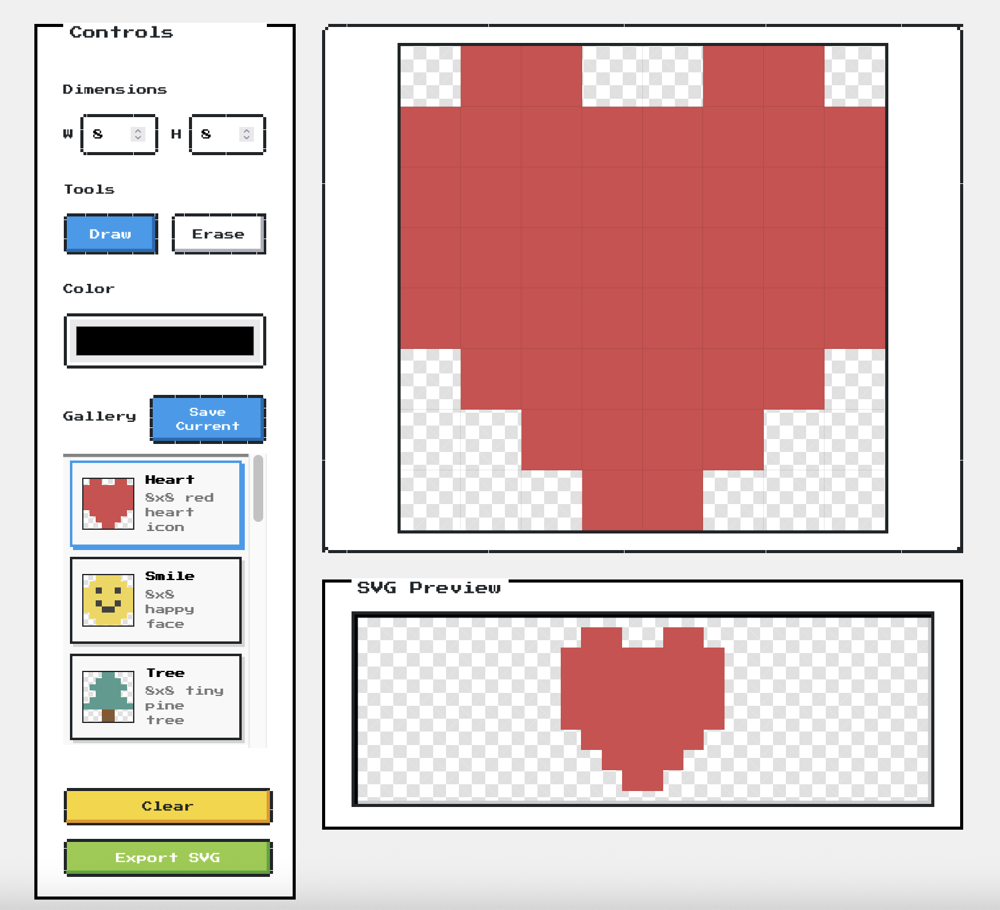

# SVG Pixel Canvas

> Create pixel art and export as clean SVG files



## Features

- **Draw & Erase** - Click or drag to paint pixels
- **Customizable Canvas** - Support for sizes from 1x1 to 128x128
- **Color Picker** - Full color selection
- **Gallery** - Save your creations locally, load built-in presets
- **SVG Export** - Download your pixel art as scalable SVG
- **Retro Aesthetic** - NES.css inspired pixel-art style UI

## Getting Started

```bash
# Install dependencies
npm install

# Start development server
npm run dev

# Build for production
npm run build

# Preview production build
npm run preview
```

## Tech Stack

- Vue 3 + TypeScript
- Vite
- NES.css (retro pixel-art UI framework)

## License

MIT
